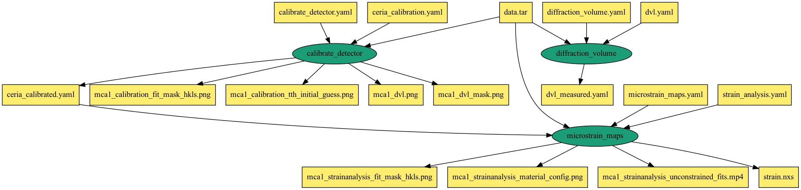

# chap-edd-workflow
Sample Pegasus workflow for running an EDD workflow as part of the CHESS Analysis
Pipelines (CHAP). The scehmatic of the workflow can be found below

## Container
The container used by the jobs in the workflow can be built using the 
apptainer/singularity definition file found at `chap.def` . The container image is 
based on an official miniconda image and setups the conda environment for the 
CHESS workflows.

## Workflow

The Pegasus workflow runs each job in a apptainer/singularity container. The 
scripts to execute the jobs are staged into the container at runtime by Pegasus
and can be found in the `executables` directory.

### Running the Workflow

The workflow is set to run on a local HTCondor Pool in the nonsharedfs
data configuration mode or on the local CHESS SGE cluster.  The main script
is `chap-edd.py` that generates the Pegasus workflow and submits it for
execution either to the local HTCondor pool or the local SGE cluster.

The workflow requires an input file `data.tar` that the user needs to 
download from the CHESS gitlab repository and place in the git checkout
directory of this repository.
