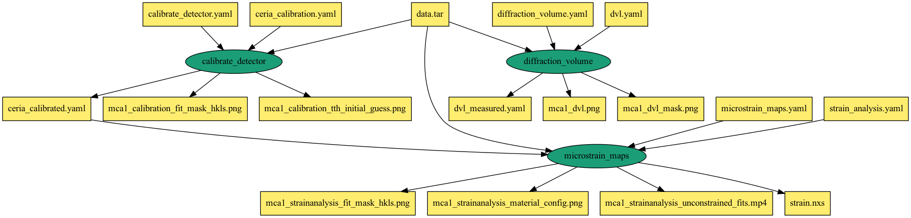

# chap-edd-workflow
Sample Pegasus workflow for running an EDD workflow as part of the CHESS Analysis Pipelines (CHAP). The scehmatic of the workflow can be found below

## Workflow

The Pegasus workflow runs each job in a container that has the CHAP python conda environment setup

